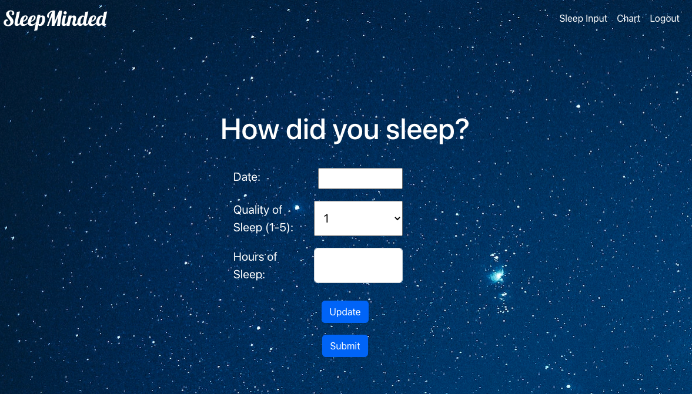

# :zzz: Sleep-Minded :zzz:

## Table of Contents

* [Description](#description)
* [Screenshot](#screenshot)
* [Installation](#installation)
* [Usage Instructions](#usage-instructions)
* [Technologies Used](#technologies-used)
* [License](#license)
* [Credits](#credits)
* [Future Developments](#future-developments)
 

## Description  

SleepMinded is a sleep tracker app using React, Express, GraphQL, and Bootstrap. SleepMinded allows you to store your quantity and quality of sleep and displays this data in a graph. 

## Screenshot  

## Installation

Please clone the repository from Github.    
Type `npm i` in the command line to install necessary dependencies. 
  

## Usage instrutions

Run the following command in the root directory of your project to start the server:
  
`npm run start`

## Technologies Used    

* React
* Express
* React-chart-js2
* Apollo-server-express
* Bcrypt
* Jsonwebtoken
* Mongo/Mongoose
* Sequelize
* Bootstrap for CSS framework

## License

MIT License

## Credits

* John Alfaro- [Github](https://github.com/jdalfaro4) 
* Manuel Corral- [Github](https://github.com/ecinematic) 
* Katie Davis- [Github](https://github.com/daviske13) 
* George Jordan- [Github](https://github.com/Judgedgeo) 
* Taylor Pogue- [Github](https://github.com/poguet) 
* CJ Adorna- [Github](https://github.com/cjado) 
* Kelly McLain- [Github](https://github.com/Rucatues) 
* Corey Calbreath- [Github](https://github.com/CoreyDC) 

Background image by user [Cerquerira](https://unsplash.com/photos/NpF9JLGYfeQ) on Unsplash. 

## Future Developments

Plans in the future are to be able to edit previous entries via a calendar and a SleepMode page which will play sleepy music to a peaceful video.